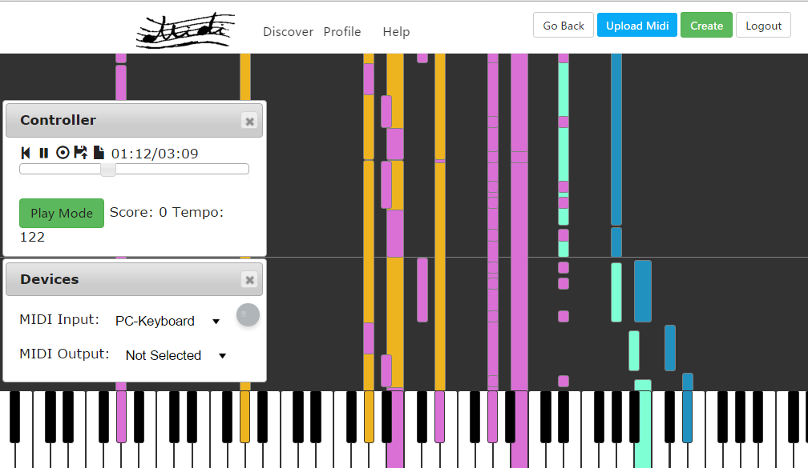

# Midi Piano Online Help

## Online Demo
http://garzon.science/midiPianoOnline/

## Welcome to Midi Piano Online!
Midi Piano Online is a website where you can share, download, and even CREATE, EDIT and PLAY with the midi files online!

### Sharing

To create a empty midi file or upload an existing one, just click on the buttons on the navi bar.

### Discover

In the index page, you can explore the midi files uploaded by others. Just click on the one you interested in and have fun!

### View the MIDI file

In the view page, you can download the midi file. You can also edit or play the midi file by clicking the Play! button, which will lead you to the player/editor page. To modify the midi based on the current one? You just fork(which means clone) the midi file to your MIDI repository to create a duplicate and enjoy. 

### Player/Editor

There is two modes: Play Mode and Edit Mode.    
In play mode, you can press the key on your PC keyboard/MIDI Input Device/the screen, to play the GAME and the player will judge your performance.     
In edit mode, when it is recording(click the circle icon in the controller dialog and it will turn red), you can add notes to the midi file. Also, you can drag the bars on the screen to edit, or select some bars and press 'delete' key to delete them. Last but not least, remember to SAVE your work by clicking the FLOPPY ICON in the controller dialog. If the midi file is not owned by you, we will automatically fork this to your repository and save your work!      

Click on the Go Back button on the navi bar to check out the midi file info.

### And more...

Click the profile to check out your repository.     
You can click on the username to know about others, and filling out your profile is recommended.

### Feel free to contact me!

My email address is garzonou@gmail.com. If you find any bugs or give some suggestions, it's welcome and just send am email to me :). I am looking forward to your email.
